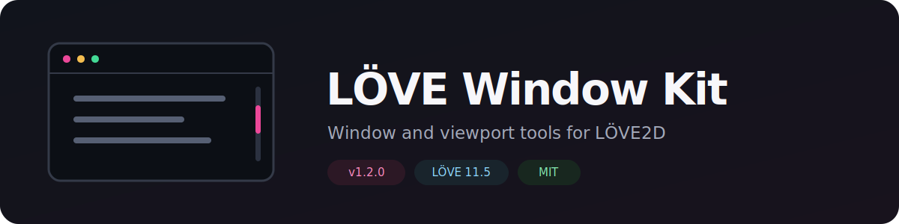
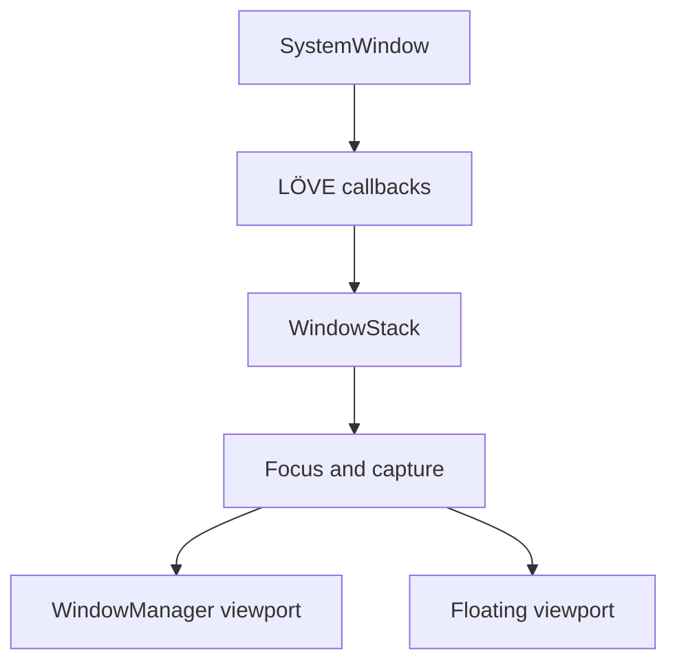

<p align="center">
  
</p>

<p align="center">
  <a href="https://github.com/SMETAHA/love2d-window-kit/actions/workflows/ci.yml"></a>
  <a href="https://github.com/SMETAHA/love2d-window-kit/actions/workflows/pages.yml"></a>
  
  
  <a href="LICENSE"></a>
</p>

<p align="center">
  A lightweight window and viewport toolkit for <strong>LÖVE2D</strong> with scrolling,
  cursor-centered zoom, draggable floating windows, layered focus routing and touch support.
</p>

<p align="center">
  <a href="https://smetaha.github.io/love2d-window-kit/">Live Demo</a> ·
  <a href="docs/API.en.md">API Reference</a> ·
  <a href="#runnable-examples">Examples</a> ·
  <a href="docs/RECIPES.md">Recipes</a> ·
  <a href="docs/MOBILE_TEST.en.md">Mobile Testing</a> ·
  <a href="docs/README.ru.md">Русская версия</a>
</p>

## Live browser demo

Open the [interactive GitHub Pages site](https://smetaha.github.io/love2d-window-kit/) to run the actual Lua library in your browser. The site uses a pinned LÖVE 11.5 `love.js` compatibility build and lets you switch between the showcase, floating inventory, multi-window dashboard, themed scrollbars, large-map culling and touch diagnostics.

The Pages workflow builds directly from the repository on every push to `main`; compiled WebAssembly files are deployment artifacts and do not need to be committed.

## Why this kit?

LÖVE gives you a powerful rendering and input layer, but it intentionally does not prescribe a windowing model. LÖVE Window Kit adds a compact, game-friendly abstraction without turning your project into a full desktop GUI framework.

| Capability | Included |
| --- | :---: |
| Smooth wheel, keyboard, drag and touch scrolling | ✓ |
| Zoom anchored under the mouse cursor | ✓ |
| Floating windows with draggable title bars | ✓ |
| Layered z-order, focus and bring-to-front | ✓ |
| Mouse capture and independent multi-touch capture | ✓ |
| Styled scrollbars with paging, hover, fade and minimum thumb size | ✓ |
| Responsive resize, high-DPI and orientation handling | ✓ |
| State save/restore and consistent scroll/zoom callbacks | ✓ |
| Lua 5.1 tests and real LÖVE 11.5 CI smoke run | ✓ |

## Quick start

Copy `WindowManager.lua`, `WindowStack.lua` and `SystemWindow.lua` into your LÖVE project:

```lua
local WindowManager = require("WindowManager")
local WindowStack = require("WindowStack")

local windows

function love.load()
    windows = WindowStack.new()

    local inventory = WindowManager.new({
        floating = true,
        x = 100,
        y = 80,
        width = 600,
        height = 400,
        title = "Inventory",
        draggable = true,
        contentWidth = 2000,
        contentHeight = 1500,
        scrollbar = { autoHide = true, minThumbSize = 28 }
    })

    windows:add(inventory, {
        layer = 100,
        draw = function(scrollX, scrollY, visibleWidth, visibleHeight)
            -- Draw content in content-space coordinates.
        end
    })
    windows:focus(inventory)
end

function love.update(dt) windows:update(dt) end
function love.draw() windows:draw() end
function love.resize(w, h) windows:resize(w, h) end
function love.mousepressed(...) windows:mousepressed(...) end
function love.mousereleased(...) windows:mousereleased(...) end
function love.mousemoved(...) windows:mousemoved(...) end
function love.wheelmoved(...) windows:wheelmoved(...) end
```

Touch, keyboard and text callbacks follow the same forwarding pattern. See [`examples/support.lua`](examples/support.lua) for the complete bridge.

## Architecture



- **`WindowManager`** owns one viewport: bounds, content coordinates, zoom, scrolling and chrome.
- **`WindowStack`** owns the collection: layers, z-order, focus and input capture.
- **`SystemWindow`** configures the actual OS window separately from in-game viewports.

## Runnable examples

Clone the repository and run any scenario from its root:

```bash
git clone https://github.com/SMETAHA/love2d-window-kit.git
cd love2d-window-kit
love . --example=multi-window-dashboard
```

| Scenario | Command | Demonstrates |
| --- | --- | --- |
| Minimal integration | `love . --minimal` | Smallest complete setup |
| Fullscreen canvas | `love . --example=fullscreen-canvas` | Pan and cursor-centered zoom |
| Floating inventory | `love . --example=floating-inventory` | Game inventory over a scrollable world |
| Multi-window dashboard | `love . --example=multi-window-dashboard` | Overlap, focus, layers and bring-to-front |
| Themed scrollbars | `love . --example=themed-scrollbars` | Theme colors, paging, hover and auto-hide |
| State and callbacks | `love . --example=state-callbacks` | Save/load and event reasons |
| Large map culling | `love . --example=large-map-culling` | A 20,000 × 20,000 tile map drawn by visible range |
| Mobile diagnostics | `love . --mobile-test` | Multi-touch, DPI and orientation |
| Full showcase | `love .` | Combined desktop demonstration |

Every scenario is a regular Lua module in [`examples/`](examples/), so it can also be used as copyable integration code.

## Configuration at a glance

```lua
local viewport = WindowManager.new({
    floating = true,
    x = 120, y = 80,
    width = 760, height = 520,
    title = "Document",
    draggable = true,
    dragToScroll = true,
    contentWidth = 2400,
    contentHeight = 1800,
    zoom = 1,
    minZoom = 0.5,
    maxZoom = 4,
    scrollbar = {
        width = 14,
        minThumbSize = 36,
        pageStep = 0.85,
        autoHide = true,
        color = {0.25, 0.8, 1, 0.9}
    },
    callbacks = {
        onScroll = function(x, y, oldX, oldY, source, reason) end,
        onZoom = function(oldZoom, zoom, source, reason) end
    }
})
```

See the complete [`API reference`](docs/API.en.md) for themes, state persistence, stack options and callback contracts.

## Testing

```bash
sh scripts/run_tests.sh
```

The suite covers geometry, input ownership, z-order, public API validation, graphics-stack recovery, high-DPI coordinates, orientation changes and every runnable example. GitHub Actions additionally downloads LÖVE 11.5, runs the project under Xvfb and builds a `.love` artifact.

## Compatibility

- LÖVE **11.5** is the primary target.
- Runtime code remains compatible with Lua 5.1 / LuaJIT semantics used by LÖVE.
- The original step-by-step API (`new()`, `load`, `setFloating`, `setFullscreen`) remains available.

## Contributing

Bug reports, focused pull requests and new example scenarios are welcome. Please read [`CONTRIBUTING.md`](CONTRIBUTING.md) before submitting changes.

## License

Released under the [MIT License](LICENSE).
